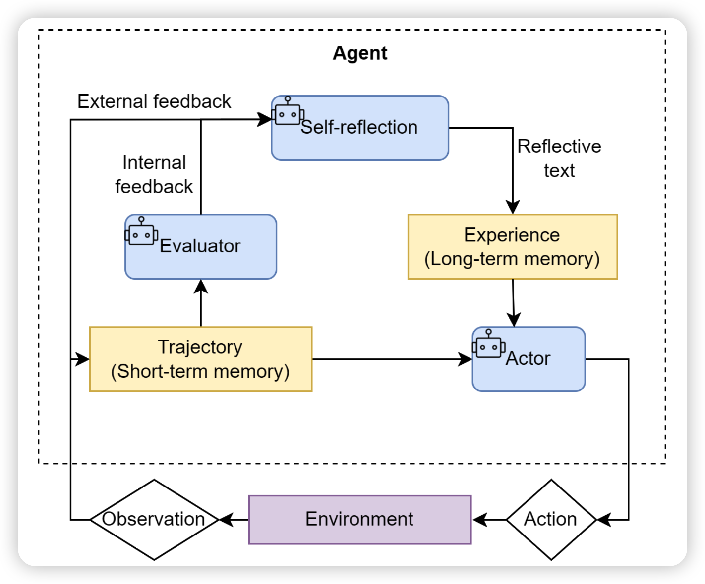

在了解 Reflection 范式之前，我们需要先了解 [Agent 范式：ReAct (Reason + Act)](ai-agent智能体经典范式构建--ReAct.md) 或 [Agent 范式：Plan-and-Solve](ai-agent智能体经典范式构建--Plan-and-Solve.md) 中的一种。

在以上两种范式中，一旦智能体完成了任务，也就代表着智能体执行结束。但是它生成的最终答案，无论是生成轨迹还是最终结果，都有可能出现错误。Reflection 的核心机制就是为智能体引入一种“事后自我矫正”的循环机制，使其能够像人类一样，审视自己的工作，发现不足，并进行迭代优化。其核心工作流程可以概括为一个简洁的三步循环：执行 -> 反思 -> 优化。

### Reflection 核心机制 

1. **执行 (Execution)**：首先，智能体使用我们熟悉的方法（如 [ReAct](ai-agent智能体经典范式构建--ReAct.md) 或 [Plan-and-Solve](ai-agent智能体经典范式构建--Plan-and-Solve.md)）尝试完成任务，生成一个初步的解决方案或行动轨迹。这可以看作是“初稿”。

2. **反思 (Reflection)**：接着，智能体进入反思阶段。它会调用一个独立的、或者带有特殊提示词的大语言模型实例，来扮演一个“评审员”的角色。这个“评审员”会审视第一步生成的“初稿”，并从多个维度进行评估，例如：
   - 事实性错误：是否存在与常识或已知事实相悖的内容？
   - 逻辑漏洞：推理过程是否存在不连贯或矛盾之处？
   - 效率问题：是否有更直接、更简洁的路径来完成任务？
   - 遗漏信息：是否忽略了问题的某些关键约束或方面？ 
   
   根据评估，它会生成一段结构化的反馈 (Feedback)，指出具体的问题所在和改进建议。

3. **优化 (Refinement)**：最后，智能体将“初稿”和“反馈”作为新的上下文，再次调用大语言模型，要求它根据反馈内容对初稿进行修正，生成一个更完善的“修订稿”。

如图所示，这个循环可以重复进行多次，直到反思阶段不再发现新的问题，或者达到预设的迭代次数上限。我们可以将这个迭代优化的过程形式化地表达出来。假设 $O_i$ 是第 $i$ 次迭代产生的输出（$O_0$ 为初始输出），反思模型 $\pi_{\text{reflect}}$ 会生成针对 $O_i$ 的反馈 $F_i$：

$$
F_i = \pi_{\text{reflect}}(\text{Task}, O_i)
$$

随后，优化模型 $\pi_{\text{refine}}$ 会结合原始任务、上一版输出以及反馈，生成新一版的输出 $O_{i+1}$：

$$
O_{i+1} = \pi_{\text{refine}}(\text{Task}, O_i, F_i)
$$



这张架构图详细展示了带有反思机制的智能体（Agent）是如何在环境中完整运作的。它的核心是一个不断循环并且自我优化的系统，主要包含以下几个关键模块：

1. **环境与执行交互 (Environment & Actor)**
   - **Environment（环境）**：智能体外部的世界（例如一个API、一个代码终端或者搜索工具）。
   - **Actor（执行器）**：智能体执行具体操作的部分。Actor 会结合当前的短期记忆（任务轨迹）和长期记忆（过往经验）来决定接下来的动作（**Action**），作用于环境后，环境会返回产生的结果（**Observation**，即观察值）。

2. **双重记忆系统 (Memory)**
   - **Trajectory / Short-term memory（短期轨迹记忆）**：相当于工作记忆。记录当前任务中发生的一系列具体的“动作”和“观察”。它保留着智能体刚刚做过什么以及看到了什么。
   - **Experience / Long-term memory（长期经验记忆）**：存储由反思模块提炼出来的高层次经验（Reflective text）。当智能体未来遇到类似问题或开启下一轮尝试时，可以直接提取这些经验，从而避免重复犯错（相当于把“知识”固化下来）。

3. **双重评估与反思机制 (Evaluator & Self-reflection)**
   - **Evaluator（评估器）**：负责分析当前的短期行动轨迹，并生成内部反馈（**Internal feedback**）。它的作用类似监控，判断“当前的做法是不是有效的？”或者“这个中间结果是否符合预期？”。
   - **Self-reflection（自我反思中心）**：这是整个机制的“大脑”。它接收来自外部环境的外部反馈（**External feedback**，如任务执行失败或成功的明确信号），并结合评估器给出的内部反馈，对之前的行为进行深度的“复盘”。它思考“为什么会做错？”、“下次应该怎么改进？”，并将思考的结果打包成反思文本（**Reflective text**），存入长期记忆库中。

总而言之，这个架构把整个过程分成了两层：下层是**基于轨迹（Trajectory）的行动与尝试**；上层则是**基于经验（Experience）的高维评估与反思**，体现了智能体不仅能感知当前的对错，还能通过总结经验实现举一反三的能力。


### 编码实现

使用 Reflection 完成一个编码任务：“编写一个 Python 函数，找出 1 到 n 之间所有的素数 (prime numbers)。”
这个任务是检验 Reflection 机制的绝佳场景：

- **存在明确的优化路径**：大语言模型初次生成的代码很可能是一个简单但效率低下的递归实现。
- **反思点清晰**：可以通过反思发现其“时间复杂度过高”或“存在重复计算”的问题。
- **优化方向明确**：可以根据反馈，将其优化为更高效的迭代版本或使用备忘录模式的版本。

Reflection 的核心是迭代，而迭代的核心是尝试并能够记住之前的尝试以及获得的反馈。因此，一个记忆模块至关重要：
```python
from typing import List, Dict, Any, Optional

class Memory:
    """
    一个简单的记忆模块，用于存储智能体的行动与反思轨迹。
    """

    def __init__(self):
        """
        初始化一个空列表来存储所有记录。
        """
        self.records: List[Dict[str, Any]] = []

    def add_record(self, record_type: str, content: str):
        """
        向记忆中添加一条新记录。

        参数:
        - record_type (str): 记录的类型 ('execution' 或 'reflection')。
        - content (str): 记录的具体内容 (例如，生成的代码或反思的反馈)。
        """
        record = {"type": record_type, "content": content}
        self.records.append(record)
        print(f"📝 记忆已更新，新增一条 '{record_type}' 记录。")

    def get_trajectory(self) -> str:
        """
        将所有记忆记录格式化为一个连贯的字符串文本，用于构建提示词。
        """
        trajectory_parts = []
        for record in self.records:
            if record['type'] == 'execution':
                trajectory_parts.append(f"--- 上一轮尝试 (代码) ---\n{record['content']}")
            elif record['type'] == 'reflection':
                trajectory_parts.append(f"--- 评审员反馈 ---\n{record['content']}")
        
        return "\n\n".join(trajectory_parts)

    def get_last_execution(self) -> Optional[str]:
        """
        获取最近一次的执行结果 (例如，最新生成的代码)。
        如果不存在，则返回 None。
        这里其实就相当于是图中的短期记忆 Trajectory（short-term memory）。
        """
        for record in reversed(self.records):
            if record['type'] == 'execution':
                return record['content']
        return None

```

这个 Memory 类的设计比较简洁，主体是这样的：

- 使用一个列表 records 来按顺序存储每一次的行动和反思。
- add_record 方法负责向记忆中添加新的条目。
- get_trajectory 方法是核心，它将记忆轨迹“序列化”成一段文本，可以直接插入到后续的提示词中，为模型的反思和优化提供完整的上下文。
- get_last_execution 方便我们获取最新的“初稿”以供反思。


Reflection 机制需要不同的角色来协同工作，因此需要三段不同的提示词：

**首次执行提示词 (Execution Prompt)**：这是智能体首次尝试解决问题的提示词，内容相对直接，只要求模型完成指定任务。
```text
INITIAL_PROMPT_TEMPLATE = """
你是一位资深的Python程序员。请根据以下要求，编写一个Python函数。
你的代码必须包含完整的函数签名、文档字符串，并遵循PEP 8编码规范。

要求: {task}

请直接输出代码，不要包含任何额外的解释。
"""

```
**反思提示词 (Reflection Prompt)**：这个提示词是 Reflection 机制的灵魂。它指示模型扮演“代码评审员”的角色，对上一轮生成的代码进行批判性分析，并提供具体的、可操作的反馈。
```text
REFLECT_PROMPT_TEMPLATE = """
你是一位极其严格的代码评审专家和资深算法工程师，对代码的性能有极致的要求。
你的任务是审查以下Python代码，并专注于找出其在<strong>算法效率</strong>上的主要瓶颈。

# 原始任务:
{task}

# 待审查的代码:
```python
{code}
```

请分析该代码的时间复杂度，并思考是否存在一种<strong>算法上更优</strong>的解决方案来显著提升性能。
如果存在，请清晰地指出当前算法的不足，并提出具体的、可行的改进算法建议（例如，使用筛法替代试除法）。
如果代码在算法层面已经达到最优，才能回答“无需改进”。

请直接输出你的反馈，不要包含任何额外的解释。
"""
```

**优化提示词 (Refinement Prompt)**：当收到反馈后，这个提示词将引导模型根据反馈内容，对原有代码进行修正和优化。
```text

REFINE_PROMPT_TEMPLATE = """
你是一位资深的Python程序员。你正在根据一位代码评审专家的反馈来优化你的代码。

# 原始任务:
{task}

# 你上一轮尝试的代码:
{last_code_attempt}
评审员的反馈：
{feedback}

请根据评审员的反馈，生成一个优化后的新版本代码。
你的代码必须包含完整的函数签名、文档字符串，并遵循PEP 8编码规范。
请直接输出优化后的代码，不要包含任何额外的解释。
"""

```

现在，我们将这套提示词逻辑和 Memory 模块整合到 ReflectionAgent 类中。

```python
import os
import re
from openai import OpenAI
from typing import List, Dict
from memory import Memory
from dotenv import load_dotenv, find_dotenv
from system_prompt import INITIAL_PROMPT_TEMPLATE, REFLECT_PROMPT_TEMPLATE, REFINE_PROMPT_TEMPLATE
load_dotenv(find_dotenv())

class HelloAgentsLLM:
    """
    它用于调用任何兼容OpenAI接口的服务，并默认使用流式响应。
    """
    def __init__(self, model: str = None, api_key: str = None, base_url: str = None, timeout: int = None):
        """
        初始化客户端。优先使用传入参数，如果未提供，则从环境变量加载。
        """
        self.model = model or os.getenv("LLM_MODEL_ID")
        api_key = api_key or os.getenv("LLM_API_KEY")
        base_url = base_url or os.getenv("LLM_BASE_URL")
        timeout = timeout or int(os.getenv("LLM_TIMEOUT", 60))
        
        if not all([self.model, api_key, base_url]):
            raise ValueError("模型ID、API密钥和服务地址必须被提供或在.env文件中定义。")

        self.client = OpenAI(api_key=api_key, base_url=base_url, timeout=timeout)

    def think(self, messages: List[Dict[str, str]], temperature: float = 0) -> str:
        """
        调用大语言模型进行思考，并返回其响应。
        """
        print(f"🧠 正在调用 {self.model} 模型...")
        try:
            response = self.client.chat.completions.create(
                model=self.model,
                messages=messages,
                temperature=temperature,
                stream=True,
            )
            
            # 处理流式响应
            print("✅ 大语言模型响应成功:")
            collected_content = []
            for chunk in response:
                content = chunk.choices[0].delta.content or ""
                print(content, end="", flush=True)
                collected_content.append(content)
            print()  # 在流式输出结束后换行
            return "".join(collected_content)

        except Exception as e:
            print(f"❌ 调用LLM API时发生错误: {e}")
            return None


class ReflectionAgent:
    def __init__(self, llm_client, max_iterations=3):
        self.llm_client = llm_client
        self.memory = Memory()
        self.max_iterations = max_iterations

    def run(self, task: str):
        print(f"\n--- 开始处理任务 ---\n任务: {task}")

        # --- 1. 初始执行 ---
        print("\n--- 正在进行初始尝试 ---")
        initial_prompt = INITIAL_PROMPT_TEMPLATE.format(task=task)
        initial_code = self._get_llm_response(initial_prompt)
        self.memory.add_record("execution", initial_code)

        # --- 2. 迭代循环:反思与优化 ---
        for i in range(self.max_iterations):
            print(f"\n--- 第 {i+1}/{self.max_iterations} 轮迭代 ---")

            # a. 反思
            print("\n-> 正在进行反思...")
            last_code = self.memory.get_last_execution()
            reflect_prompt = REFLECT_PROMPT_TEMPLATE.format(task=task, code=last_code)
            feedback = self._get_llm_response(reflect_prompt)
            self.memory.add_record("reflection", feedback)

            # b. 检查是否需要停止
            if "无需改进" in feedback:
                print("\n✅ 反思认为代码已无需改进，任务完成。")
                break

            # c. 优化
            print("\n-> 正在进行优化...")
            refine_prompt = REFINE_PROMPT_TEMPLATE.format(
                task=task,
                last_code_attempt=last_code,
                feedback=feedback
            )
            refined_code = self._get_llm_response(refine_prompt)
            self.memory.add_record("execution", refined_code)
        
        final_code = self.memory.get_last_execution()
        print(f"\n--- 任务完成 ---\n最终生成的代码:\n```python\n{final_code}\n```")
        return final_code

    def _get_llm_response(self, prompt: str) -> str:
        """一个辅助方法，用于调用LLM并获取完整的流式响应。"""
        messages = [{"role": "user", "content": prompt}]
        response_text = self.llm_client.think(messages=messages) or ""
        return response_text

if __name__ == "__main__":
    question = "编写一个Python函数，找出1到n之间所有的素数 (prime numbers)。"
    llm_client = HelloAgentsLLM()
    agent = ReflectionAgent(llm_client)
    agent.run(question)
```

### Reflection 机制的成本和收益

Reflection 机制在提升智能体解决任务的质量上表现出色，但同样也会付出相应的成本。

**主要成本**：
- **模型调用开销增加**：这是最直接的成本。每进行一轮迭代，至少需要额外调用两次大语言模型（一次用于反思，一次用于优化）。如果迭代多轮，API 调用成本和计算资源消耗将成倍增加。
- **任务延迟显著提高**：Reflection 是一个串行过程，每一轮的优化都必须等待上一轮的反思完成。这使得任务的总耗时显著延长，不适合对实时性要求高的场景。
- **提示工程复杂度上升**：如我们的案例所示，Reflection 的成功在很大程度上依赖于高质量、有针对性的提示词。为“执行”、“反思”、“优化”等不同阶段设计和调试有效的提示词，需要投入更多的开发精力。

**核心收益**：
- **解决方案质量的跃迁**：最大的收益在于，它能将一个“合格”的初始方案，迭代优化成一个“优秀”的最终方案。这种从功能正确到性能高效、从逻辑粗糙到逻辑严谨的提升，在很多关键任务中是至关重要的。
- **鲁棒性与可靠性增强**：通过内部的自我纠错循环，智能体能够发现并修复初始方案中可能存在的逻辑漏洞、事实性错误或边界情况处理不当等问题，从而大大提高了最终结果的可靠性。

综上所述，Reflection 机制是一种典型的“以成本换质量”的策略。它非常适合那些对最终结果的质量、准确性和可靠性有极高要求，且对任务完成的实时性要求相对宽松的场景。例如：
- 生成关键的业务代码或技术报告。
- 在科学研究中进行复杂的逻辑推演。
- 需要深度分析和规划的决策支持系统。