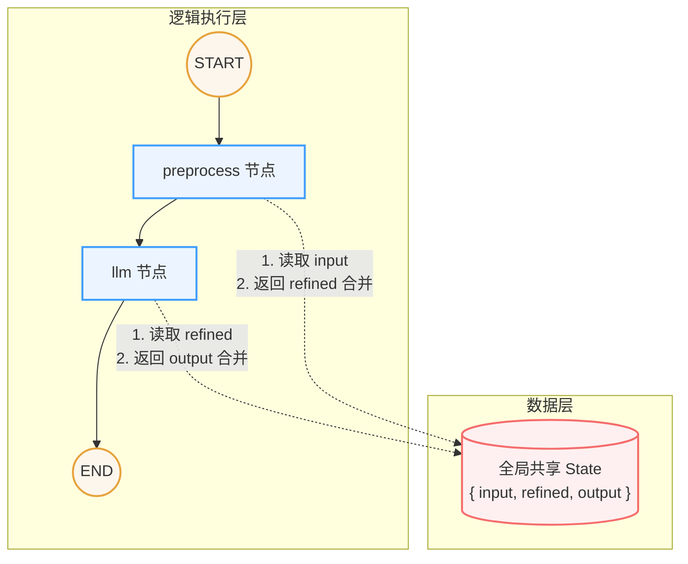

## 简单概念

LangGraph 是一个使用图结构编排 LLM（大型语言模型）调用流程的框架。在 LangGraph 中，**节点（Node）**负责处理逻辑，**边（Edge）**控制流程走向，而**状态（State）**则在各个节点之间传递数据。

### BaseMessage 体系
- LangChain 推荐使用消息对象替代裸字符串。
- 主要包含三种角色：`SystemMessage`（系统消息） / `HumanMessage`（人类消息） / `AIMessage`（AI 回复消息）。
- 每条消息都有明确的 `role` 和 `content`，例如：`{"role": "system", "content": "你是一个专业的 Python 开发工程师"}`。

### 多轮对话的本质
LLM 本身是没有记忆的，每一次调用对它而言都是一次全新的请求。
- **多轮对话的实现**：需要把完整的历史聊天记录塞进消息列表，一起传给 `invoke()` 方法。
- `AIMessage` 可以直接追加进历史记录中，不需要进行额外的数据格式转换。

## 基本流程



### State（状态）
`State` 是 LangGraph 框架中使用的核心数据结构，一般使用 `TypedDict` 来约束并定义好需要的字段格式。
状态数据在所有的节点中都是**全局共享**的，你可以将其理解为一个全局上下文（Context）。

### Node（节点）
`Node` 本质上是一个普通的 Python 函数，该函数接收当前的 `State` 作为输入参数，并返回需要更新的数据字典。框架会自动执行数据 Merge 操作（将返回的新字段同名合并更新到全局的 `State` 中）。

### Edge（边）
`Edge` 负责定义各个节点之间的执行路径与先后顺序，控制着整个工作流的走向。

```python
# 添加边：定义执行顺序
# START 和 END 是 LangGraph 内置的特殊节点
builder.add_edge(START, "preprocess")    # 流程从 preprocess 节点开始
builder.add_edge("preprocess", "llm")    # preprocess 执行完毕后进入 llm 节点
builder.add_edge("llm", END)             # llm 节点执行完毕后结束流程
```
上面的代码定义了一个简单的线性图：`开始 -> preprocess -> llm -> 结束`。


## 高阶用法

### `add_messages` 消息追加工具
如果要在 `State` 中保存一个消息列表字段，并且希望每次节点返回新数据时都能向后**追加**（而不是被框架默认的 Merge 操作覆盖），这时就需要使用 `add_messages` 辅助函数。

```python
from typing import Annotated
from typing_extensions import TypedDict
from langgraph.graph.message import add_messages

class State(TypedDict):
    # 使用 Annotated 配合 add_messages，指明遇到新消息时进行追加操作
    messages: Annotated[list, add_messages]

def chat_1(state: State) -> dict:
    """第一轮：用户问题 → LLM 第一次回复"""
    print(f"\n[chat_1] 收到消息数：{len(state['messages'])}")
    
    response = llm.invoke(state["messages"])
    print(f"[chat_1] LLM 回复：{response.content[:60]}...")
    
    # 返回的内容会自动触发 add_messages，从而将 response 追加到 state 的 messages 末尾
    return {"messages": [response]}
```
只要按照上述代码使用 `Annotated` 定义列表，在一次完整的工作流中，框架就会自动地帮你把新回复正确追加到历史消息列表中记录下来。

### 条件路由（conditional_edges）

在前文 **Edge（边）** 的内容中，我们演示了框架内如何指定静态的执行顺序。但这种线性方式具有局限性：例如在一个 Agent 中，有的用户提问需要更深度的查询或操作，而有的用户可能只是打个招呼闲聊。此时，工作流就需要根据实际的内容意图来进行条件判定与动态走向分发。
```python
# ── State ─────────────────────────────────────
class State(TypedDict):
    messages: Annotated[list, add_messages]
    intent: str  # 识别出的意图，路由函数会读取这个字段


# ── 节点 ──────────────────────────────────────
def intent_node(state: State) -> dict:
    """识别用户意图：data_query 或 general_chat"""
    user_msg = state["messages"][-1].content
    prompt = f"""判断以下用户输入的意图，只返回一个词（不要其他任何内容）：
- data_query：涉及数据查询（充值、用户、收入、DAU、GMV 等指标）
- general_chat：普通问候或非数据问题

用户输入：{user_msg}
意图："""
    response = llm.invoke([HumanMessage(content=prompt)])
    intent = response.content.strip().lower()
    # 容错：LLM 可能返回带解释的文字，提取关键词
    intent = "data_query" if "data_query" in intent else "general_chat"
    print(f"[intent_node] 识别意图：{intent}")
    return {"intent": intent}

def data_query_node(state: State) -> dict:
    """数据查询分支：模拟返回数据（后续章节会替换成真实工具）"""
    print("[data_query_node] 走数据查询分支 ✓")
    fake_result = "（模拟数据）今日 DAU：52 万，充值：156.8 万元，留存率：38%"
    return {
        "messages": [
            HumanMessage(content=fake_result, name="data_system")
        ]
    }


def general_chat_node(state: State) -> dict:
    """闲聊分支：直接 LLM 回复"""
    print("[general_chat_node] 走闲聊分支 ✓")
    response = llm.invoke(state["messages"])
    return {"messages": [response]}

# ── 路由函数 ──────────────────────────────────
# 路由函数规则：
#   输入：当前 State
#   输出：下一个节点的名称（字符串）
# Literal 类型注解是可选的，但让返回值更清晰
def route_by_intent(state: State) -> Literal["data_query", "general_chat"]:
    """读取 intent 字段，决定走哪条分支"""
    return "data_query" if state["intent"] == "data_query" else "general_chat"


# ── 构建图 ────────────────────────────────────
builder = StateGraph(State)
builder.add_node("intent", intent_node)
builder.add_node("data_query", data_query_node)
builder.add_node("general_chat", general_chat_node)

builder.add_edge(START, "intent")

# add_conditional_edges(
#   source_node,      ← 从哪个节点出发
#   routing_function, ← 路由函数（返回字符串）
#   path_map,         ← {返回值 → 目标节点名}
# )
builder.add_conditional_edges(
    "intent",
    route_by_intent,
    {
        "data_query": "data_query",
        "general_chat": "general_chat",
    },
)
builder.add_edge("data_query", END)
builder.add_edge("general_chat", END)

graph = builder.compile()
```
按照代码所示，工作流会根据用户的输入，让 LLM 判断这段对话应该被定义为数据查询还是闲聊，然后分别动态流转到不同的路由分支。

**路由函数不是节点。** 两者有本质区别：

| | 节点 | 路由函数 |
|---|---|---|
| 返回值 | `dict`（更新 State） | `str`（下一个节点名） |
| 能修改 State | 能 | 不能（改了也没效果） |
| 框架如何使用 | 将返回值 merge 到 State | 只取字符串查找下一节点 |

路由函数的职责只有一件事：读取 State，返回一个字符串告诉框架接下来去哪。即便在函数内部对 `state` 的字段赋值，框架也不会处理，修改不会生效。想修改 State，只能通过节点的返回 `dict` 来触发。

> **注意**：在上述代码的 `intent_node` 节点中，我们直接使用提示词来限制大模型的输出文本。但在实际生产环境中这种方式是不够稳定的（很容易出现大模型幻觉或附加多余字符的问题），建议此时通过 `with_structured_output` 等结构化输出能力来严格约束大模型的返回格式。