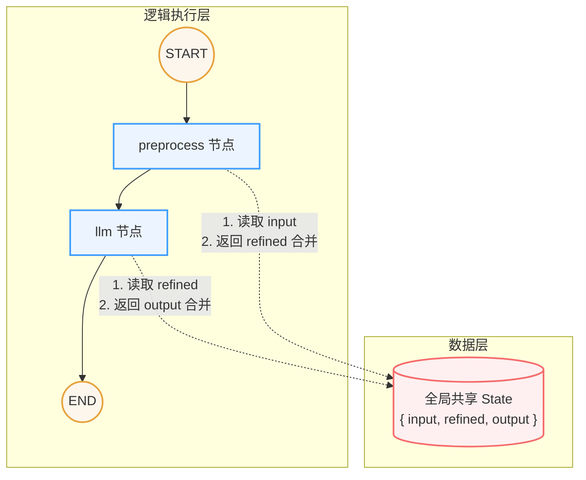

## 简单概念

LangGraph 是一个使用图结构编排 LLM（大型语言模型）调用流程的框架。在 LangGraph 中，**节点（Node）**负责处理逻辑，**边（Edge）**控制流程走向，而**状态（State）**则在各个节点之间传递数据。

### BaseMessage 体系
- LangChain 推荐使用消息对象替代裸字符串。
- 主要包含三种角色：`SystemMessage`（系统消息） / `HumanMessage`（人类消息） / `AIMessage`（AI 回复消息）。
- 每条消息都有明确的 `role` 和 `content`，例如：`{"role": "system", "content": "你是一个专业的 Python 开发工程师"}`。

### 多轮对话的本质
LLM 本身是没有记忆的，每一次调用对它而言都是一次全新的请求。
- **多轮对话的实现**：需要把完整的历史聊天记录塞进消息列表，一起传给 `invoke()` 方法。
- `AIMessage` 可以直接追加进历史记录中，不需要进行额外的数据格式转换。

## 核心组件



### State（共享状态数据）
在 LangGraph 框架中用到的核心数据结构，一般使用 `TypedDict` 来约束并指定好需要的字段格式。
状态数据在所有的节点中都是**共享**的，你可以将其理解为一个全局上下文（Context）工具。

### Node（处理函数）
Node 本质上是一个普通的 Python 函数，该函数接收整个 `state` 作为输入参数，并输出需要修改的字段及其新值。框架会自动执行数据 Merge（将返回的新字段合并更新到全局的 State 中）。

### Edge（执行顺序）
也叫作边，它负责定义各个节点之间的执行路径与先后顺序。

```python
# 添加边：定义执行顺序
# START 和 END 是 LangGraph 内置的特殊节点
builder.add_edge(START, "preprocess")    # 流程从 preprocess 节点开始
builder.add_edge("preprocess", "llm")    # preprocess 执行完毕后进入 llm 节点
builder.add_edge("llm", END)             # llm 节点执行完毕后结束流程
```
上面的代码定义了一个简单的线性图：`开始 -> preprocess -> llm -> 结束`。

### `add_messages` 消息合并工具
如果要在 State 中保存一个列表字段，并且希望每次节点返回新数据时都能往后**追加**（而不是被框架自动 Merge 的默认行为覆盖掉），这时就需要使用到 `add_messages` 辅助函数。

```python
from typing import Annotated
from typing_extensions import TypedDict
from langgraph.graph.message import add_messages

class State(TypedDict):
    # 使用 Annotated 配合 add_messages，指明遇到新消息时进行追加操作
    messages: Annotated[list, add_messages]

def chat_1(state: State) -> dict:
    """第一轮：用户问题 → LLM 第一次回复"""
    print(f"\n[chat_1] 收到消息数：{len(state['messages'])}")
    
    response = llm.invoke(state["messages"])
    print(f"[chat_1] LLM 回复：{response.content[:60]}...")
    
    # 返回的内容会自动触发 add_messages，从而将 response 追加到 state 的 messages 末尾
    return {"messages": [response]}
```
只要按照上述代码使用 `Annotated` 定义列表，在一次完整的工作流中，框架就会自动地帮你把新回复正确追加到历史消息列表中记录下来。

